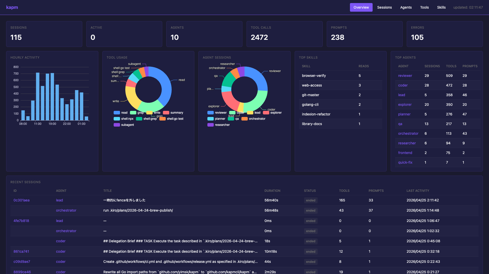

# kapm

[](https://github.com/kapmcli/kapm/actions/workflows/ci.yml)
[](https://go.dev/)
[](LICENSE)

Kiro Agent Package Manager — adapts [APM](https://microsoft.github.io/apm/) content into Kiro-native `.kiro/` files.


## Installation

### Homebrew (macOS / Linux)

```bash
brew install --cask kapmcli/tap/kapm
```

### Build from source

```bash
just build
```

## Quick start

```bash
# Convert existing APM content to .kiro/
kapm sync

# Install an APM package and sync
kapm install owner/repo

# Create a Kiro agent interactively
kapm agent generate

# Enable session logging
kapm init-hook

# View session metrics (TUI)
kapm monitor

# WebUI dashboard
kapm serve
```

## Commands

### `kapm sync`

Reads APM content from `.apm/`, `apm_modules/`, and MCP dependencies in `apm.yml`, then writes the corresponding `.kiro/` output.

```bash
kapm sync            # skip existing files
kapm sync --force    # overwrite existing files
```

Source precedence: local `.apm/` > installed modules (in `apm.yml` dependency order) > fallback path sort. Existing files are skipped unless `--force` is passed.

### `kapm install`

Runs `apm install` (or `uvx --from apm-cli apm install` as fallback), then syncs the result into `.kiro/`.

```bash
kapm install owner/repo
kapm install --update owner/repo
kapm install github/awesome-copilot/skills/review-and-refactor
```

All arguments are forwarded to `apm install`. The only kapm-specific flag is `--sync-force` (overwrites `.kiro/` files during the post-install sync).

### `kapm agent generate` / `kapm agent update`

Interactively create or update `.kiro/agents/<name>.json` and `.kiro/agent-prompts/<name>.md`.

```bash
kapm agent generate            # create new agent
kapm agent generate --force    # overwrite existing
kapm agent update <name>       # update existing agent
```

### `kapm init-hook`

Installs a structured JSONL logger into selected agents. Every hook event (`agentSpawn`, `userPromptSubmit`, `preToolUse`, `postToolUse`, `stop`) is recorded to `.kiro/logs/{session_id}.jsonl`.

```bash
kapm init-hook             # interactive agent selection
kapm init-hook --remove    # remove kapm-managed hooks
```

Re-running is safe — existing hooks are replaced, not duplicated. Your own hook entries are preserved.

**Note**: `kapm sync --force` and `kapm install --sync-force` rewrite agent JSON and remove hooks. Re-run `kapm init-hook` after force-sync.

### `kapm monitor`

TUI dashboard for session metrics from `.kiro/logs/`. Use `kapm serve` for the WebUI.

```bash
kapm monitor                              # TUI
kapm monitor --json                       # JSON to stdout
kapm monitor --session=<sid>              # single session (merged)
kapm monitor --session=<sid> --agent=<a>  # single session, single agent

kapm serve                                # WebUI on :9090
kapm serve --port 9097                    # custom port
```



#### WebUI routes

| Route | Description |
|---|---|
| `GET /` | Overview dashboard |
| `GET /sessions` | Session list |
| `GET /sessions/{id}` | Merged session detail |
| `GET /sessions/{id}/{agent}` | Per-agent session detail |
| `GET /agents` | Agent list |
| `GET /tools` | Tool usage |
| `GET /skills` | Skill reads |

## Output mapping

| APM source | Kiro output |
|---|---|
| instructions | `.kiro/steering/<name>.md` |
| prompts | `.kiro/prompts/<name>.md` |
| commands | `.kiro/prompts/<name>.md` |
| skills | `.kiro/skills/<name>/...` |
| agents / chatmodes | `.kiro/agents/<name>.json` + `.kiro/agent-prompts/<name>.md` |
| MCP dependencies | `.kiro/settings/mcp.json` (merged) |

## Logging

### Log contents

Each JSONL line contains `ts`, `agent`, `session`, `event`, and where applicable `tool`, `tool_input`, `tool_response`, `prompt`, `cwd`.

**Warning**: logs include full tool input/response which may contain file paths, source code, or credentials. `.kiro/logs/` is gitignored and created with `0o700` / files `0o600`.

### Rotation

On `agentSpawn`, idle session files (>24h since last write) are gzip-compressed to `.jsonl.gz`. Active sessions are left as `.jsonl`.

## Requirements

- Go 1.26+
- `apm` on PATH, or [uv](https://github.com/astral-sh/uv) for the `uvx` fallback

## Development

`kapm` embeds the `kapl` binary via `//go:embed`. Always build via the Justfile:

```bash
just build   # kapl → embed → kapm
just test
just lint
```

Manual build (if `just` is unavailable):

```bash
go build -o internal/agent/kapl ./cmd/kapl
go build -o kapm ./cmd/kapm
```

## Links

- [APM docs](https://microsoft.github.io/apm/) · [APM quick start](https://microsoft.github.io/apm/getting-started/quick-start/) · [APM manifest schema](https://microsoft.github.io/apm/reference/manifest-schema/) · [APM CLI](https://microsoft.github.io/apm/reference/cli-commands/) · [APM source](https://github.com/microsoft/apm)
- [Kiro prompts](https://kiro.dev/docs/cli/chat/manage-prompts/) · [Kiro skills](https://kiro.dev/docs/skills/) · [Kiro steering](https://kiro.dev/docs/steering/) · [Kiro custom agents](https://kiro.dev/docs/chat/subagents/)
