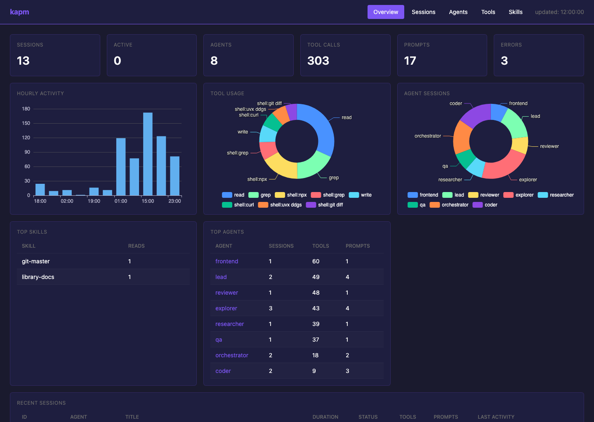
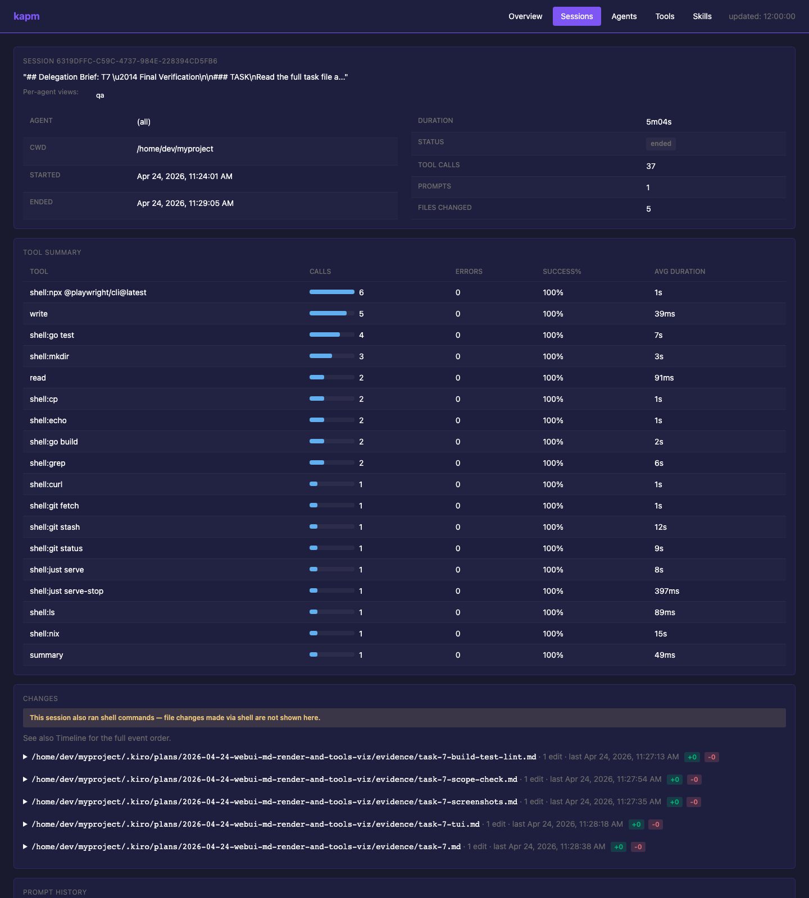

<h1 align="center">kapm</h1>

<p align="center">
  面向 Kiro Agent 项目的可观测性工具和包兼容工具。
</p>

<p align="center">
  <a href="https://github.com/kapmcli/kapm/actions/workflows/ci.yml"></a>
  <a href="https://go.dev/"></a>
  <a href="LICENSE"></a>
</p>

<p align="center">
  <a href="README.md">English</a> · <a href="README.ja.md">日本語</a> · <a href="README.ko.md">한국어</a> · 简体中文
</p>

<p align="center">
  
</p>

## kapm 的用途

kapm 是一个 CLI，用于理解和维护 Kiro Agent 工作区。

- **监控 Kiro 会话**：将 hook 事件记录到 `.kapm/logs`，并在 TUI 或 WebUI 中查看会话、工具调用、失败、耗时、派生的 Agent、提示、响应和 Skill 读取情况。
- **管理 Kiro Agent**：以交互方式创建和更新 `.kiro/agents/*.json` 与 `.kiro/agent-prompts/*.md`。
- **连接包格式**：将 APM 包和 Kiro Power 同步为项目本地的 `.kiro/` 文件。

## 安装

### Homebrew (macOS / Linux)

```bash
brew install --cask kapmcli/tap/kapm
```

### 发布归档

从 [GitHub Releases](https://github.com/kapmcli/kapm/releases) 下载适合你平台的归档文件，解压后将 `kapm` 或 `kapm.exe` 放到 `PATH` 中。

### Nix (Nightly)

```bash
nix profile add github:kapmcli/kapm#kapm
```

### 从源码构建

```bash
just build
```

## 快速开始

```bash
# 创建或更新 Kiro Agent。
kapm agent generate

# 为选中的 Agent 安装 kapm hook。
kapm init-hook

# 正常运行 Kiro，然后查看记录的会话。
kapm monitor
kapm serve
```

## 监控

`kapm init-hook` 会向选中的 `.kiro/agents/*.json` 文件添加由 kapm 管理的 hook 条目。Kiro 发出 hook 事件时，这些条目会运行 `kapm hook-handler --agent <name>`。

hook 事件会以 JSONL 写入 `.kapm/logs/{session_id}.jsonl`。`kapm monitor` 在终端中读取这些日志，`kapm serve` 则通过本地 WebUI 展示同一份数据。

```bash
kapm init-hook             # 交互式选择 Agent
kapm init-hook --remove    # 移除 kapm 管理的 hook 条目

kapm monitor
kapm monitor --json
kapm monitor --json --session <session-id>
kapm monitor --json --session <session-id> --agent <agent-name>

kapm serve
kapm serve --port 9097 --open
```

`monitor` 和 `serve` 都支持：

```bash
--since 24h
--logs-dir <path>
--target-dir <path>
```





### WebUI 路由

| Route | 说明 |
|---|---|
| `GET /` | Overview 仪表盘 |
| `GET /sessions` | 会话列表 |
| `GET /sessions/{id}` | 合并后的会话详情 |
| `GET /sessions/{id}/{agent}` | 按 Agent 查看会话详情 |
| `GET /agents` | Agent 列表 |
| `GET /agents/{name}` | Agent 详情 |
| `GET /tools` | 工具使用情况 |
| `GET /tools/{name}` | 工具详情 |
| `GET /skills` | Skill 读取情况 |

## Agent 配置

```bash
kapm agent generate
kapm agent generate --force
kapm agent update <name>
```

`agent generate` 会创建 `.kiro/agents/<name>.json` 和 `.kiro/agent-prompts/<name>.md`。`agent update` 会编辑现有 Agent，并保留未知的 JSON 字段。

## APM 兼容

```bash
kapm sync
kapm sync --force

kapm install owner/repo
kapm install --update owner/repo
kapm install github/awesome-copilot/skills/review-and-refactor
```

`kapm sync` 会读取本地 `.apm/`、已安装的 `apm_modules/` 以及 `apm.yml` 中的 MCP 依赖，并将 Kiro 原生文件写入 `.kiro/`。除非使用 `--force`，否则会跳过已有文件。

`kapm install` 会把安装过程委托给 `apm install`。如果找不到 `apm`，kapm 会回退到 `uvx --from apm-cli==0.9.1 apm install`。安装完成后会执行相同的 sync 步骤。

`install` 支持的 kapm 专用参数：

```bash
--sync-force            # 在 sync 步骤中覆盖 .kiro 文件
--target-dir <path>     # 指定要同步的项目目录
```

`--global` 会原样转发给 APM，并使用用户主目录作为 sync 根目录。它不能与 `--target-dir` 同时使用。

## Kiro Power 兼容

```bash
kapm power install ./local/power
kapm power install owner/repo
kapm power install owner/repo/path/to/power --ref main
kapm power install https://github.com/owner/repo
kapm power install https://github.com/owner/repo/tree/main/path/to/power
```

`power install` 会将原始 Power 包复制到 `.kiro/powers/<name>/`。它不会生成 Skill 文件、合并 MCP 设置或启用 hook，而是输出后续配置所需的具体片段：

- 指向 `POWER.md` 和 `steering/*.md` 的 `file://` resource 条目
- 当 Power 包含 `mcp.json` 时的 `mcpServers` 内容
- 当 Power 包含 `hooks/` 时，需要迁移到 Agent `hooks` 字段的文件列表
- 手动删除命令

使用 `--force` 可以覆盖已有的 kapm 管理 Power 目录。

## 兼容映射

| Source | Kiro output |
|---|---|
| APM `instructions` | `.kiro/steering/<name>.md` |
| APM `prompts` | `.kiro/prompts/<name>.md` |
| APM `commands` | `.kiro/prompts/<name>.md` |
| APM `skills` | `.kiro/skills/<name>/...` |
| APM `agents` / `chatmodes` | `.kiro/agents/<name>.json` + `.kiro/agent-prompts/<name>.md` |
| APM MCP dependencies | `.kiro/settings/mcp.json` |
| Kiro Power package | `.kiro/powers/<name>/...` |

## 日志格式和保留

每条 JSONL 记录可能包含 `ts`、`agent`、`session`、`event`、`tool`、`tool_input`、`tool_response`、`assistant_response`、`prompt` 和 `cwd`。

日志可能包含文件路径、源代码、提示词、模型响应，或工具输入输出中的凭据。`.kapm/` 已加入 gitignore；目录以 `0700` 权限创建，日志文件以 `0600` 权限创建。

发生 `agentSpawn` 时，超过 24 小时未写入的空闲会话日志会压缩为 `.jsonl.gz`。活跃会话会保留为 `.jsonl`。

## 开发

```bash
just build
just test
just lint
```

如果没有 `just`：

```bash
go build -o kapm ./cmd/kapm      # macOS / Linux
go build -o kapm.exe ./cmd/kapm  # Windows
```

## Links

- [APM docs](https://microsoft.github.io/apm/) · [APM CLI](https://microsoft.github.io/apm/reference/cli-commands/) · [APM source](https://github.com/microsoft/apm)
- [Kiro prompts](https://kiro.dev/docs/cli/chat/manage-prompts/) · [Kiro skills](https://kiro.dev/docs/skills/) · [Kiro steering](https://kiro.dev/docs/steering/) · [Kiro custom agents](https://kiro.dev/docs/chat/subagents/)
- [design.md](https://github.com/google-labs-code/design.md)
